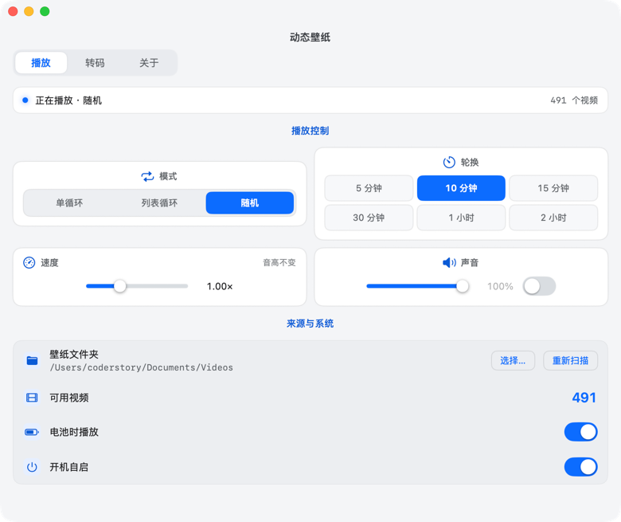

# 壁纸儿

把一个文件夹里的视频当 macOS 桌面壁纸循环播放。菜单栏常驻，全屏、最大化窗口、锁屏、电池供电时自动让路。

原生 Swift + SwiftUI，零第三方依赖。



菜单栏常驻，关窗不退出。全屏 / 最大化窗口 / 锁屏 / 熄屏 / 电池供电时自动让路。

## 特性

- **原生硬解**播放 mp4 / mov / m4v，裁剪填满主屏，不占用解码器
- **菜单栏常驻**，关设置窗口只隐藏窗口，进程不退出
- **让路条件**：全屏 / 最大化窗口 / 锁屏 / 显示器熄屏 / 系统睡眠，条件解除后自动续播（不从头开始）
- **单循环续播** —— 重启软件接着上次的视频、从上次的进度继续播
- **设置即时生效** —— 模式、速度、音量、轮换改完立刻见效，不用重启、不等下次换片
- **速度可调且保持原音高**
- **内置转码与降帧** —— mkv / avi / webm 转成能硬解的格式，高帧率视频可降帧，命令行可审计
- **不偷电**：电池供电时可开暂停（默认关）

## 需求

| | |
|---|---|
| 系统 | macOS 27 |
| 工具链 | Swift 6.4（Xcode 27） |
| 依赖 | 无。`swift build` 不触网 |
| 转码（可选） | 需要 `ffmpeg` 在 PATH 里。不需要转码可不装 |

## 构建

```bash
git clone https://github.com/<你的用户名>/dynamic-wallpaper.git
cd dynamic-wallpaper
./build.sh
```

产物在 `dist/`：`壁纸儿-0.1.0.dmg`。

**不签名、不公证** —— 首次打开需要右键 → 打开，或：

```bash
xattr -dr com.apple.quarantine /Applications/壁纸儿.app
```

只想编译不想打包：

```bash
swift build   # 编译
swift test    # 单元测试
```

## 使用

1. 菜单栏图标（播放三角）→ **打开设置**
2. **选择…** 挑一个视频文件夹（递归子目录）
3. 顶部 **播放 / 片库 / 通用** 三个标签页

菜单栏菜单：

| 菜单项 | 快捷键 |
|---|---|
| 暂停 / 继续 | |
| 立即下一个 | |
| 重新扫描文件夹 | |
| 打开设置 | ⌘, |
| 退出 | ⌘Q |

菜单**不显示当前播放的文件名**。

## 转码与降帧

壁纸目录里的 mkv / avi / webm 原生播不了，高于 60fps 的视频费电。**片库**标签页的处理队列把它们列出来（自动区分「转码」与「降帧」），选目录或文件，点**开始处理**。

- 产物输出到壁纸目录的 `Converted/` 子目录
- 自动扫描到的源文件，转码成功后自动删除；手动选的文件保留
- 产物不会再进入待处理队列
- 每条任务展示进度与状态，转码任务可查看**将要执行的完整命令**

## 设计取舍

**代码越少越好。** 优先系统 API 而非自造，优先框架能力而非手写。少文件、少抽象层、不过度处理。

几个具体的：

- 菜单栏图标只有**单窗 + 三角**。菜单栏模板图只有 22pt 高，双窗描边在 @1x 下两根窗框线会挤在 4–5 像素里，辨识度反而不如单窗
- 播放速度挂在 `AVPlayer` 而非 `AVPlayerItem` —— `AVLooper` 副本初始化时会冻结，改模板 item 属性不生效，那样「改设置立即生效」是假的
- 设置窗不做视频预览。app 里不展示任何视频
- 状态用**圆点 + 文字**双编码，不靠颜色单独传递信息

## 许可

GPL v2 —— 见 [LICENSE](LICENSE)。

Copyright (C) 2026 CoderStory

## 免责声明

按「现状」提供，不含任何明示或默示担保。作者不对使用造成的任何损失负责。